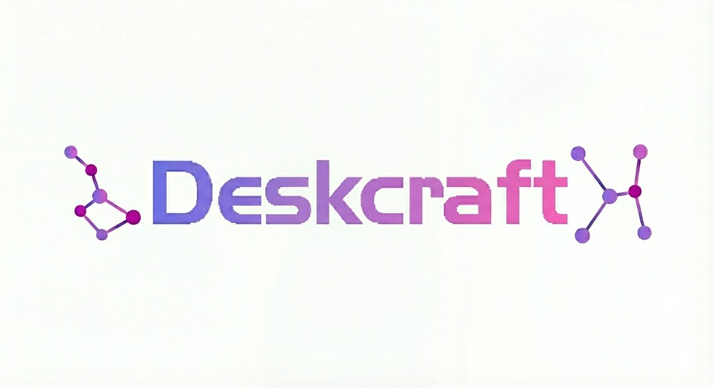

<p align="center">
  
</p>

<h1 align="center">DeskCraft</h1>

<p align="center">
  <strong>Organizador Inteligente de Arquivos para Windows</strong><br>
  Regras visuais IF→THEN, simulação antes de executar, rollback completo — 100% offline.
</p>

<p align="center">
  
  
  
  
  
  
  
  
</p>

---

## Sobre

O **DeskCraft** é um aplicativo desktop premium que organiza arquivos automaticamente usando regras visuais no estilo `SE → ENTÃO`. Pensado para quem acumula screenshots, downloads, PDFs e instaladores, e quer manter Desktop e pastas de trabalho sempre limpos sem perder o controle.

Funciona **100% offline**, sem telemetria e sem dependência de nuvem. A única conexão de rede é a verificação opcional de atualizações.

### Principais recursos

- **Motor de organização IF→THEN** — Condições (extensão, nome, tamanho, data, regex) combinadas com AND/OR e ações sequenciais (mover, renomear, subpastas, tags)
- **Simulação antes de executar** — Veja exatamente o que vai acontecer com cada arquivo, sem mover nada
- **Rollback completo** — Desfaça qualquer execução, mesmo dias depois, com auditoria por arquivo
- **Perfis contextuais** — Trabalho, Estudos, Pessoal — cada perfil com seu próprio conjunto de regras
- **Drag-and-drop** — Reordene regras arrastando; a prioridade segue a ordem visual
- **Watcher em tempo real** — Monitora pastas e organiza arquivos novos no momento que chegam
- **Agendamento** — Cron simplificado (diário, semanal, por hora) para organização recorrente
- **Resolução de conflitos** — Sufixo numérico, pasta `_conflitos` ou pergunta interativa
- **Auto-update integrado** — Atualizações silenciosas via API CodeCraft GenZ
- **Iniciar com o Windows** — Toggle nas configurações que cria/remove entrada no registry HKCU\Run
- **Tema claro/escuro** com seleção também pelo SO
- **Bilíngue** — Português (pt-BR) e Inglês (en-US)
- **Help Center offline + Tour guiado**
- **Licença vinculada ao hardware** com ativação por e-mail (compra única)

---

## Tecnologias

| Camada | Tecnologia |
|---|---|
| Shell desktop | [Tauri 2](https://tauri.app) (Rust + WebView2) |
| Frontend | React 18 + TypeScript 5 + Vite 6 |
| Estilo | Tailwind CSS 3 + Framer Motion |
| Estado | Zustand 5 |
| Drag-and-drop | [@dnd-kit](https://dndkit.com/) |
| Backend | Rust (stable) com `rusqlite`, `notify`, `tokio`, `reqwest` |
| Banco de Dados | SQLite (bundled) com sistema de migrations |
| Testes | Vitest + Testing Library (**84 testes**) |
| Instalador | Inno Setup 6 |
| Auto-update | `tauri-plugin-updater` + API CodeCraft GenZ |

---

## Arquitetura

```
DeskCraft/
├── src/                              # Frontend React
│   ├── components/                   # Views por área (rules, profiles, history, ...)
│   ├── stores/                       # Zustand stores (1 por domínio)
│   ├── lib/                          # tauri invoke, constants, i18n
│   ├── types/                        # Tipos compartilhados
│   ├── assets/                       # Logo e estilos globais
│   └── App.tsx                       # Router + ErrorBoundary global e granular
├── src-tauri/                        # Backend Rust
│   ├── src/
│   │   ├── commands/                 # ~60 comandos expostos ao frontend
│   │   ├── db/                       # Migrations + queries SQLite
│   │   ├── organizer/                # Scanner, simulator, executor
│   │   ├── rules/                    # Engine de avaliação de regras
│   │   ├── license/                  # Hardware ID + ativação por e-mail
│   │   ├── watcher/                  # File system watcher (notify crate)
│   │   └── lib.rs                    # Setup + auto-updater + scheduler loop
│   ├── icons/                        # Ícones HD (16 → 1024px, pixel-perfect)
│   └── tauri.conf.json               # Config Tauri (updater, bundle, capabilities)
├── installer/
│   ├── deskcraft.iss                 # Script Inno Setup
│   └── Output/                       # Instalador final
├── docs/                             # PRD, Arquitetura, BACKLOG, Plano de QA
└── generate_icons.py                 # Pipeline de geração de ícones (PIL)
```

---

## Pré-requisitos

- **Windows 10/11** (x64)
- [Node.js 20+](https://nodejs.org/)
- [Rust stable](https://rustup.rs/)
- [Tauri prerequisites](https://tauri.app/start/prerequisites/) (WebView2 + MSVC build tools)
- [Inno Setup 6](https://jrsoftware.org/isinfo.php) (para gerar instalador final)

---

## Como compilar

```bash
git clone https://github.com/CodeCraftgenz/DeskCraft.git
cd DeskCraft

npm install              # Instala dependências
npm run tauri dev        # Modo dev (hot reload)
npm run tauri build      # Build release (gera .exe + .msi + .nsis)
npm test                 # Roda 84 testes
```

Build de release gera:
- `src-tauri/target/release/deskcraft.exe` — executável
- `src-tauri/target/release/bundle/nsis/DeskCraft_X.Y.Z_x64-setup.exe` — instalador NSIS (usado pelo auto-update)
- `src-tauri/target/release/bundle/nsis/DeskCraft_X.Y.Z_x64-setup.exe.sig` — assinatura (precisa de chave privada)
- `src-tauri/target/release/bundle/msi/DeskCraft_X.Y.Z_x64_en-US.msi` — instalador MSI

---

## Como gerar o instalador final (Inno Setup)

```powershell
npm run tauri build
& "C:\Program Files (x86)\Inno Setup 6\ISCC.exe" installer\deskcraft.iss
```

Saída: `installer/Output/DeskCraft-Setup-{versão}.exe`

### Regerar ícones HD

```bash
python scripts/generate_icons.py
```

Gera todos os tamanhos PNG (16 → 1024px), `.ico` com 9 sizes pixel-perfect (16/20/24/32/40/48/64/128/256), `.icns` macOS e os BMPs do wizard do instalador a partir de `assets/img/Instaldor.png`.

---

## Auto-update

O app verifica atualizações automaticamente **3 segundos após abrir**:

```
GET https://api.codecraftgenz.com.br/api/updates/deskcraft
```

Se houver versão nova:
1. Mostra diálogo nativo **"Atualização disponível"** com botões **Atualizar** / **Depois**
2. Aceitando, baixa via NSIS, instala e reinicia o app
3. Falhas de rede são silenciosas — o app nunca trava por causa de update

### Publicar nova versão

1. **Bumpar versão** nos 4 arquivos: [package.json](package.json), [src-tauri/tauri.conf.json](src-tauri/tauri.conf.json), [src-tauri/Cargo.toml](src-tauri/Cargo.toml), [installer/deskcraft.iss](installer/deskcraft.iss)
2. **Rebuild**: `npm run tauri build && iscc installer\deskcraft.iss`
3. **Upload do .exe** NSIS para o servidor de downloads
4. **POST** para `https://api.codecraftgenz.com.br/api/apps/{ID}/release` com `version`, `executableUrl`, `signature` (conteúdo do `.sig`) e `changelog`

> ⚠️ **`signature` é obrigatória** para Tauri v2. Sem o `.sig` o cliente rejeita o download. O `.sig` só é gerado se a env var `TAURI_SIGNING_PRIVATE_KEY` estiver definida no build.

---

## Banco de dados

SQLite local com as seguintes tabelas principais:

- **rules** — Regras de organização
- **rule_conditions** — Condições (campo, operador, valor) por regra
- **rule_actions** — Ações (mover, renomear, tag) por regra
- **profiles** — Perfis contextuais (Trabalho, Estudos, etc.)
- **profile_rules** — Relação N:N entre perfis e regras
- **runs** — Histórico de execuções (manual, simulação, watcher, agendado)
- **run_items** — Detalhes por arquivo de cada execução (para rollback)
- **schedules** — Agendamentos cron por perfil + pasta
- **watched_folders** — Pastas monitoradas e seus modos
- **settings** — Configurações persistentes (tema, idioma, conflito, log level)
- **tour_state** — Progresso do tour de onboarding
- **help_favorites** / **help_views** — Tracking do Help Center

---

## Versão 1.0.1 — Notas

Esta versão consolida o ciclo de QA completo. **11 bugs corrigidos** e **3 features implementadas**:

### Correções
- **TC-01-001** — CMD não abre mais na instalação nem na 1ª execução (adicionado `CREATE_NO_WINDOW` em todas chamadas `Command::new` no Rust)
- **TC-06-001/004/008/009** — Criar e editar perfis não trava mais. Adicionado comando `update_profile` no backend, removido race entre `loadRuleCounts` e mutações no editor
- **TC-03-004/005, TC-11-008, TC-12-010** — Tela não fica mais preta ao trocar tema, resetar dicas ou tour. Removido `AnimatePresence` problemático e adicionado **ErrorBoundary granular** que mostra stack trace ao invés de tela vazia
- **TC-05-006** — Regex inválido agora é validado antes de salvar (try/catch com `new RegExp()`)
- **TC-04-009** — **Drag-and-drop real** nas regras via [@dnd-kit](https://dndkit.com/) + comando Rust `reorder_rules` transacional

### Novidades
- **TC-01-005** — Toggle "Iniciar com Windows" agora funciona (escreve/remove entrada `HKCU\Software\Microsoft\Windows\CurrentVersion\Run` via `reg.exe`)
- **TC-03-007** — Internacionalização (i18n) PT-BR / EN-US em sidebar, header, settings e títulos das telas
- **Auto-update funcional** via API CodeCraft GenZ

---

## Documentação

- [PRD](docs/PRD.md) — Visão de produto, personas e roadmap
- [Arquitetura](docs/ARCHITECTURE.md) — Arquitetura técnica detalhada
- [Banco de Dados](docs/DATABASE.md) — Schema completo
- [Backlog](docs/BACKLOG.md) — Histórias e sprints
- [Estrutura do Projeto](docs/PROJECT_STRUCTURE.md) — Organização de pastas
- [Plano de Testes QA](docs/QA_TEST_PLAN.html) — 121 casos de teste manual

---

## Licenciamento

DeskCraft é um produto de **compra única**. Adquira em [codecraftgenz.com.br](https://codecraftgenz.com.br).

A licença é vinculada ao hardware (CPU ID + motherboard serial via SHA-256). A ativação pede apenas o e-mail cadastrado na compra.

---

## Desenvolvido por

**[CodeCraft GenZ](https://codecraftgenz.com.br)**
